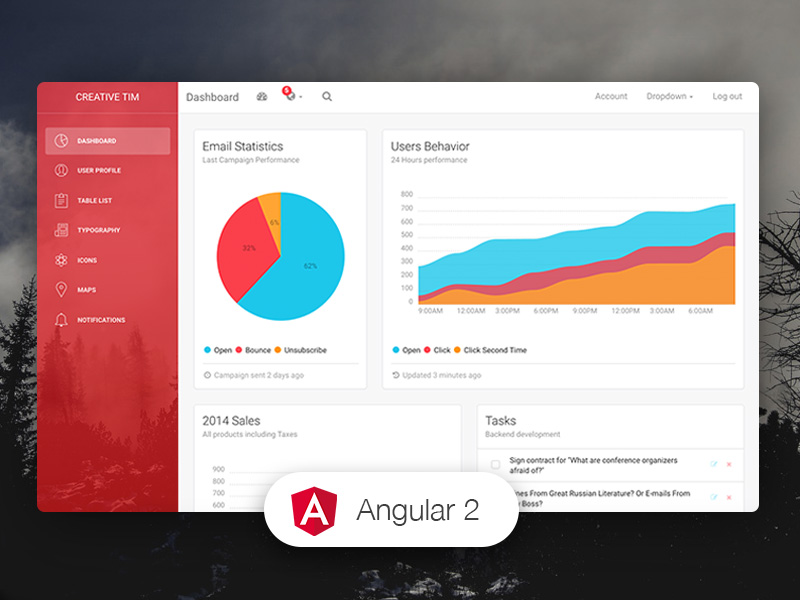

# [Light Bootstrap Dashboard Angular 2](http://lbd-angular2.creative-tim.com/)



**[Light-Bootstrap-Dashboard-Angular2](http://lbd-angular2.creative-tim.com/)** is an admin dashboard template designed to be beautiful and simple. It is built on top of Bootstrap 3, using [Light Bootstrap Dashboard](https://www.creative-tim.com/product/light-bootstrap-dashboard) and it is fully responsive. It comes with a big collections of elements that will offer you multiple possibilities to create the app that best fits your needs. It can be used to create admin panels, project management systems, web applications backend, CMS or CRM.

The product represents a big suite of front-end developer tools that can help you jump start your project. We have created it thinking about things you actually need in a dashboard. Light Bootstrap Dashboard Angular 2 contains multiple handpicked and optimized plugins. Everything is designed to fit with one another. As you will be able to see, the dashboard you can access on Creative Tim is a customization of this product.

It comes with 6 filter colors for the sidebar (“black”, “azure”,”green”,”orange”,”red”,”purple”) and an option to have a background image.

Special thanks go to: Robert McIntosh for the notification system Chartist for the wonderful charts We are very excited to share this dashboard with you and we look forward to hearing your feedback!

## Links:

+ [Live Preview](http://lbd-angular2.creative-tim.com/)
+ [Light Bootstrap Dashboard PRO Angular2](https://www.creative-tim.com/product/light-bootstrap-dashboard-pro-angular2/?ref=lbd-angular2-free) ($49)

## Quick Start:

Quick start options:

+ [Download from Github](https://github.com/creativetimofficial/light-bootstrap-dashboard-angular/archive/master.zip).
+ [Download from Creative Tim](https://www.creative-tim.com/product/light-bootstrap-dashboard-angular2).
+ Clone the repo: `git clone https://github.com/creativetimofficial/light-bootstrap-dashboard-angular.git`.

## Terminal Commands

1. Install NodeJs from [NodeJs Official Page](https://nodejs.org/en).
2. Open Terminal
3. Go to your file project
4. Run in terminal: ```npm install```
5. And: ```npm start```

### What's included

Within the download you'll find the following directories and files:

```
└── lbd-angular2
	├── License.rtf
	├── README.md
	├── app
	│   ├── app.component.html
	│   ├── app.component.js
	│   ├── app.component.js.map
	│   ├── app.component.ts
	│   ├── app.module.js
	│   ├── app.module.js.map
	│   ├── app.module.ts
	│   ├── dashboard
	│   │   ├── dashboard.component.html
	│   │   ├── dashboard.component.js
	│   │   ├── dashboard.component.js.map
	│   │   ├── dashboard.component.ts
	│   │   ├── dashboard.module.js
	│   │   ├── dashboard.module.js.map
	│   │   ├── dashboard.module.ts
	│   │   ├── dashboard.routes.js
	│   │   ├── dashboard.routes.js.map
	│   │   ├── dashboard.routes.ts
	│   │   ├── home
	│   │   │   ├── home.component.html
	│   │   │   ├── home.component.js
	│   │   │   ├── home.component.js.map
	│   │   │   └── home.component.ts
	│   │   ├── icons
	│   │   │   ├── icons.component.html
	│   │   │   ├── icons.component.js
	│   │   │   ├── icons.component.js.map
	│   │   │   └── icons.component.ts
	│   │   ├── maps
	│   │   │   ├── maps.component.html
	│   │   │   ├── maps.component.js
	│   │   │   ├── maps.component.js.map
	│   │   │   └── maps.component.ts
	│   │   ├── notifications
	│   │   │   ├── notifications.component.html
	│   │   │   ├── notifications.component.js
	│   │   │   ├── notifications.component.js.map
	│   │   │   └── notifications.component.ts
	│   │   ├── table
	│   │   │   ├── table.component.html
	│   │   │   ├── table.component.js
	│   │   │   ├── table.component.js.map
	│   │   │   └── table.component.ts
	│   │   ├── typography
	│   │   │   ├── typography.component.html
	│   │   │   ├── typography.component.js
	│   │   │   ├── typography.component.js.map
	│   │   │   └── typography.component.ts
	│   │   ├── upgrade
	│   │   │   ├── upgrade.component.html
	│   │   │   ├── upgrade.component.js
	│   │   │   ├── upgrade.component.js.map
	│   │   │   └── upgrade.component.ts
	│   │   └── user
	│   │       ├── user.component.html
	│   │       ├── user.component.js
	│   │       ├── user.component.js.map
	│   │       └── user.component.ts
	│   ├── main.js
	│   ├── main.js.map
	│   ├── main.ts
	│   ├── shared
	│   │   ├── footer
	│   │   │   ├── footer.component.html
	│   │   │   ├── footer.component.js
	│   │   │   ├── footer.component.js.map
	│   │   │   ├── footer.component.ts
	│   │   │   ├── footer.module.js
	│   │   │   ├── footer.module.js.map
	│   │   │   └── footer.module.ts
	│   │   └── navbar
	│   │       ├── navbar.component.html
	│   │       ├── navbar.component.js
	│   │       ├── navbar.component.js.map
	│   │       ├── navbar.component.ts
	│   │       ├── navbar.module.js
	│   │       ├── navbar.module.js.map
	│   │       └── navbar.module.ts
	│   └── sidebar
	│       ├── sidebar-routes.config.js
	│       ├── sidebar-routes.config.js.map
	│       ├── sidebar-routes.config.ts
	│       ├── sidebar.component.html
	│       ├── sidebar.component.js
	│       ├── sidebar.component.js.map
	│       ├── sidebar.component.ts
	│       ├── sidebar.metadata.js
	│       ├── sidebar.metadata.js.map
	│       ├── sidebar.metadata.ts
	│       ├── sidebar.module.js
	│       ├── sidebar.module.js.map
	│       └── sidebar.module.ts
	├── assets
	│   ├── css
	│   │   ├── animate.min.css
	│   │   ├── bootstrap.min.css
	│   │   ├── demo.css
	│   │   ├── light-bootstrap-dashboard.css
	│   │   ├── light-bootstrap-dashboard.css.map
	│   │   └── pe-icon-7-stroke.css
	│   ├── fonts
	│   ├── img
	│   ├── js
	│   │   ├── bootstrap-checkbox-radio-switch.js
	│   │   ├── bootstrap-notify.js
	│   │   ├── bootstrap-select.js
	│   │   ├── bootstrap.min.js
	│   │   ├── chartist.js
	│   │   ├── chartist.min.js
	│   │   ├── charts.d.ts
	│   │   ├── charts.js
	│   │   ├── demo.js
	│   │   ├── jquery-3.1.1.js
	│   │   ├── light-bootstrap-dashboard.js
	│   │   ├── notify.d.ts
	│   │   └── notify.js
	│   └── sass
	│       ├── lbd
	│       └── light-bootstrap-dashboard.scss
	├── documentation
	│   ├── css
	│   │   └── documentation.css
	│   └── tutorial-lbd-angular2.html
	├── index.html
	├── npm-debug.log
	├── package.json
	├── systemjs.config.js
	└── tsconfig.json
```

### Version logs

14 Dec '16 [initial Release]

v1.3.0.0 (v1.3.0 Light Bootstrap Dashboard HTML)

## Useful Links

More products from Creative Tim: <https://www.creative-tim.com/bootstrap-themes>

Tutorials: <https://www.youtube.com/channel/UCVyTG4sCw-rOvB9oHkzZD1w>

Freebies: <https://www.creative-tim.com/products>

Affiliate Program (earn money): <https://www.creative-tim.com/affiliates/new>

Social Media:

Twitter: <https://twitter.com/CreativeTim>

Facebook: <https://www.facebook.com/CreativeTim>

Dribbble: <https://dribbble.com/creativetim>

Google+: <https://plus.google.com/+CreativetimPage>

Instagram: <https://instagram.com/creativetimofficial>
